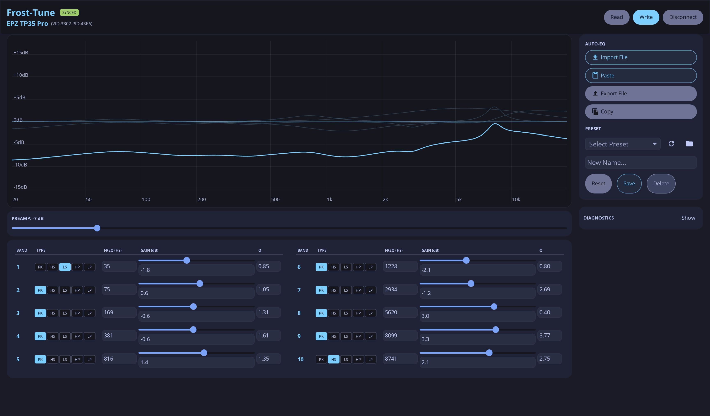

# Frost-Tune

Native cross-platform parametric EQ editor for USB DACs.


Frost-Tune is a desktop app for tuning PEQ directly on supported USB DACs.
It is built in Rust with Iced, runs fully offline, and talks to hardware over
USB HID using a safety-first push model.

## Why Frost-Tune

- Native performance and small binaries
- Predictable hardware behavior with transactional writes
- Clean desktop UX aligned with Material 3 principles
- Extensible protocol layer for more DACs over time

## Current device support

- EPZ TP35 Pro (`0x3302` / `0x43E6`) - supported

## Screenshot



## Safety model

Frost-Tune treats hardware writes as a critical operation:

1. Write new EQ payload
2. Read back device state
3. Verify values match
4. Roll back automatically on mismatch

Additional safety constraints:

- Band gain limit: `+10 dB`
- Global preamp limit: `+10 dB`
- HID I/O is isolated to a background worker thread

## Installation

### Prerequisites

- Rust toolchain: <https://rustup.rs>
- Git
- Platform-specific dependencies:
  - Linux: `libhidapi-dev`
  - Windows: Visual C++ build tools

### Build from source

```bash
git clone https://github.com/Bukutsu/frost-tune.git
cd frost-tune
cargo build --release
cargo run --release
```

## Linux permissions (polkit + helper)

On Linux, Frost-Tune can relaunch in helper mode with `pkexec` when direct HID
access is denied.

No global install is required for local development, but for packaged/system
usage:

```bash
cargo build --release --bin frost-tune-hid-helper
sudo make install
```

Manual install (alternative):

```bash
sudo mkdir -p /usr/libexec/frost-tune
sudo cp target/release/frost-tune-hid-helper /usr/libexec/frost-tune/
sudo cp packaging/linux/org.frosttune.hid.policy /usr/share/polkit-1/actions/
```

### Optional legacy udev mode

If polkit is not available:

```bash
echo 'SUBSYSTEM=="hidraw", ATTRS{idVendor}=="3302", \
ATTRS{idProduct}=="43e6", MODE="0666"' \
| sudo tee /etc/udev/rules.d/99-frosttune.rules
sudo udevadm control --reload-rules && sudo udevadm trigger
```

## Usage

1. Connect a supported DAC
2. Launch Frost-Tune
3. Adjust PEQ bands (Freq / Q / Gain)
4. Preview and validate response curve
5. Push settings to device (transactional verify is automatic)
6. Save or export profiles as needed

## Development

### Useful commands

```bash
cargo check
cargo build
cargo run
cargo test
cargo build --release
```

### Project structure

```text
frost-tune/
|- src/
|  |- main.rs
|  |- lib.rs
|  |- models.rs
|  |- storage.rs
|  |- error.rs
|  |- diagnostics.rs
|  |- autoeq.rs
|  |- bin/
|  |  `- frost-tune-hid-helper.rs
|  |- hardware/
|  |  |- mod.rs
|  |  |- worker.rs
|  |  |- protocol.rs
|  |  |- dsp.rs
|  |  |- hid.rs
|  |  |- packet_builder.rs
|  |  |- elevated_transport.rs
|  |  |- helper_ipc.rs
|  |  `- helper_server.rs
|  `- ui/
|     |- mod.rs
|     |- main_window.rs
|     |- state.rs
|     |- messages.rs
|     |- graph.rs
|     |- theme.rs
|     |- tokens.rs
|     `- views/
`- packaging/linux/org.frosttune.hid.policy
```

## Troubleshooting

If device access fails on Linux:

1. Confirm helper policy exists:
   - `/usr/share/polkit-1/actions/org.frosttune.hid.policy`
2. Confirm helper binary exists:
   - `/usr/libexec/frost-tune/frost-tune-hid-helper`
3. Retry connection from the app
4. Fall back to udev mode if needed

## Contributing

Contributions are welcome.

Before opening a PR, read [AGENTS.md](AGENTS.md) for architecture and safety
rules, especially HID threading and transactional write requirements.

Recommended pre-PR checks:

```bash
cargo fmt
cargo check
cargo test
```

## Roadmap

- Expand support for additional USB DACs
- Improve profile workflows and diagnostics
- Validate and package broader cross-platform distribution

## License

MIT. See [LICENSE](LICENSE).

## Acknowledgments

- [Iced](https://iced.rs/) for native Rust GUI
- [hidapi](https://github.com/libusb/hidapi) for cross-platform HID access
- [tp35pro-eq](https://github.com/Bukutsu/tp35pro-eq) for protocol reference
